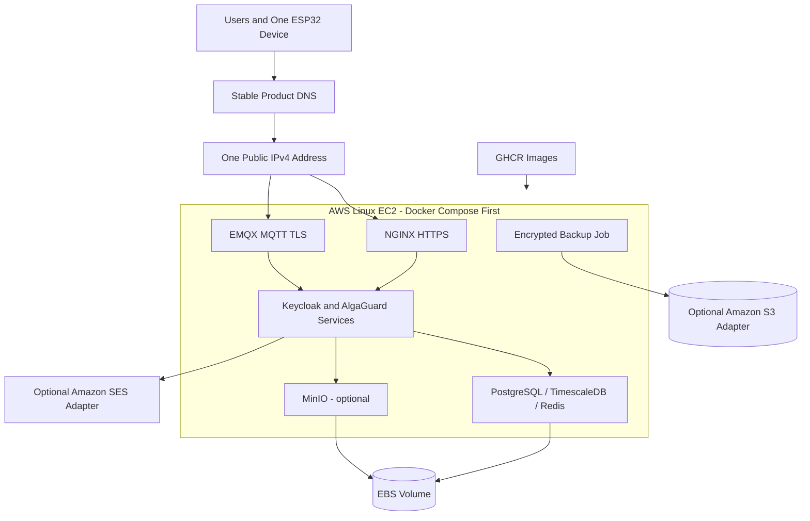

# Temporary AWS deployment

Status: planned one-device pilot. Region, instance size, eligibility, and approved budget are `TBD`.

## Runtime decision

Use one AWS Linux EC2 VM with Docker Compose first. Consider single-node k3s only after the Compose stack is stable and only when Kubernetes learning is an explicit objective. Do not deploy EKS, MSK, or Kafka for this pilot.

`ASSUMPTION`: Local measurements will determine whether a small VM can host all logical components. Logical microservice boundaries may be combined into fewer pilot containers without merging data ownership or contracts. A small instance might not run Keycloak, databases, EMQX, observability, and all services comfortably.

## Storage and operations

- Use EBS sized for container data, database headroom, logs, and local backup staging.
- Make daily database and Keycloak backups; copy at least one encrypted backup off the VM and test restore regularly.
- Use one public IPv4 address where IPv6-only access is not feasible. Account for the address, DNS, data transfer, snapshots, and EBS separately from compute.
- S3 may hold backups or firmware only through the S3-compatible adapter. SES may send email only through the email-provider adapter.
- Pull the same images later used on campus from GHCR.
- Terminate unused resources and retain only explicitly approved backups.

The dated cost assessment and official AWS references are in the [six-month cost plan](../project-management/aws-six-month-cost-plan.md). The authoritative boundaries and decisions are [provider adapters](../backend/provider-adapters.md), [ADR-014: AWS temporary host](../decisions/ADR-014-aws-temporary-host.md), and [ADR-016: S3-compatible storage](../decisions/ADR-016-s3-compatible-storage.md).
