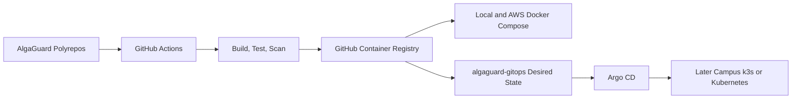

# Deployment architecture

This is a planned CI/CD and GitOps flow. Phase 1 creates no workflow, Compose, Kubernetes, Helm, Terraform, or Argo CD implementation. The authoritative progression is [local to AWS to campus](cloud-portability.md).
