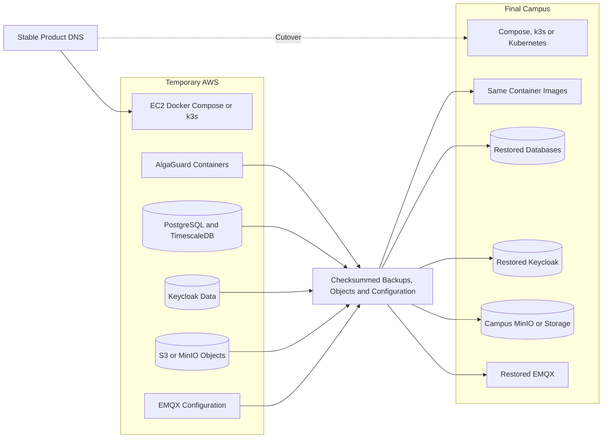

# AWS-to-campus migration architecture

Migration changes infrastructure configuration and stable DNS targets. It does not change AlgaGuard business logic or the ESP32 MQTT/HTTPS protocols. No ESP32 reflashing is required solely because hosting moves.



```text
TEMPORARY AWS                                      FINAL CAMPUS
+-------------------------+                       +-------------------------+
| EC2 Linux               |                       | Campus Linux / K8s      |
| Docker Compose or k3s   |                       | Compose, k3s or K8s     |
| EMQX                    |      backups          | EMQX                    |
| Keycloak                |  ----------------->   | Keycloak                |
| Express services        |  images and config    | Same Express services   |
| PostgreSQL/TimescaleDB  |  objects and certs    | PostgreSQL/TimescaleDB  |
| Redis                   |                       | Redis                   |
| S3 or MinIO             |                       | MinIO/campus storage     |
+------------+------------+                       +------------+------------+
             |                                                 ^
             +------------- stable DNS cutover -----------------+
```

See [migration tasks and rollback](../project-management/campus-migration-plan.md), [provider adapters](../backend/provider-adapters.md), [ADR-014: AWS temporary host](../decisions/ADR-014-aws-temporary-host.md), [ADR-015: campus final host](../decisions/ADR-015-campus-final-host.md), and [ADR-016: S3-compatible storage](../decisions/ADR-016-s3-compatible-storage.md).
