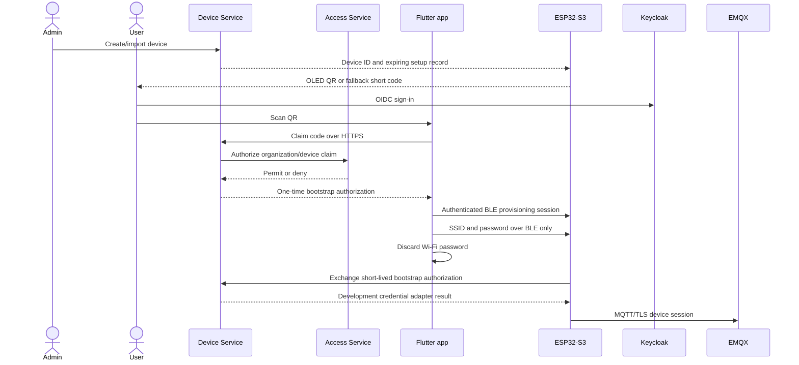
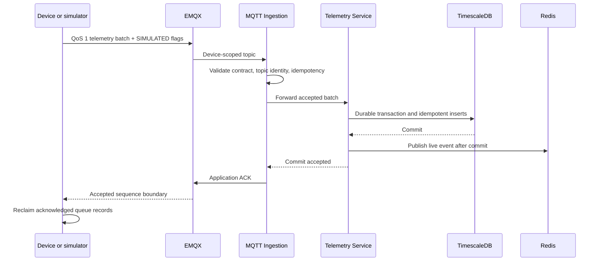
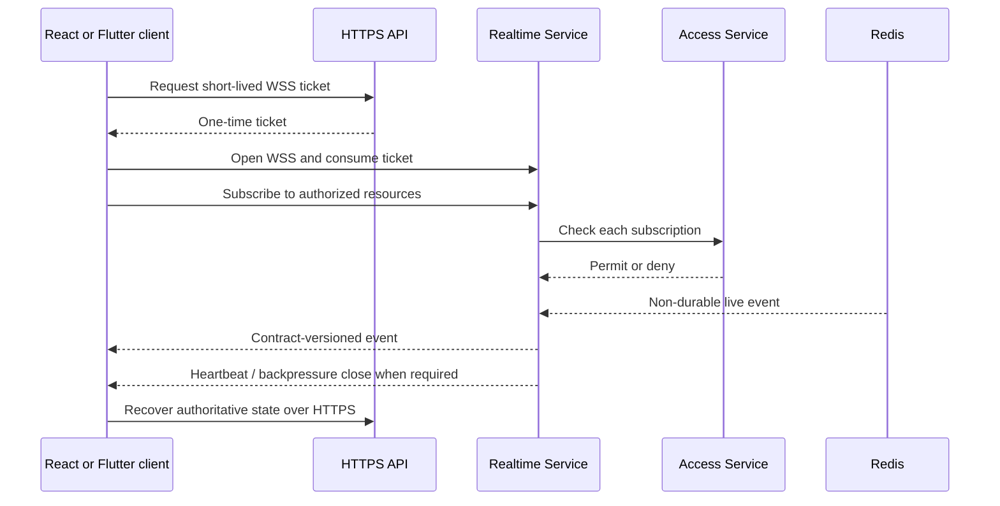
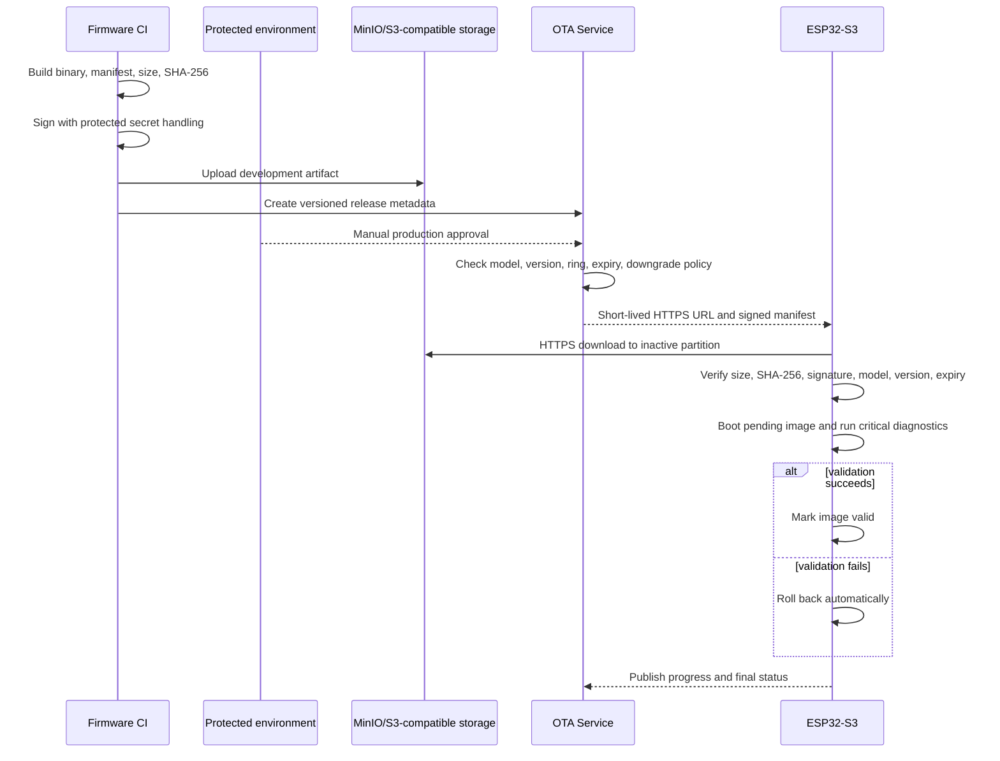

# Platform-first foundation

Status: implemented foundation; production approval and physical-device verification remain open.

The platform-first phase establishes a portable development stack, service boundaries, browser and mobile clients, secure onboarding flow, realtime delivery, OTA control plane, and a minimum USB-powered ESP32-S3 firmware foundation. It deliberately proves the software vertical slice before battery, removable storage, sensor, or production-host work.

## Scope and evidence boundaries

- `CONFIRMED`: The portable runtime uses Linux containers, Docker Compose, NGINX, Keycloak, EMQX, TimescaleDB/PostgreSQL, Redis, MinIO, Prometheus, Grafana, Loki, Tempo, and OpenTelemetry Collector.
- `CONFIRMED`: Backend services use Node.js 22, TypeScript, and Express. The web client uses React, TypeScript, Vite, React Router, TanStack Query, and native WebSocket. The mobile client uses Flutter, Riverpod, Dio, secure storage, QR scanning, BLE abstractions, and native WebSocket.
- `CONFIRMED`: The firmware target is ESP32-S3-DevKitC-1 N16R8 with PlatformIO and ESP-IDF. Runtime diagnostics must verify the actual chip, flash, and PSRAM before physical acceptance.
- `CONFIRMED`: Local automated validation exercises identity, one-time device claim, immutable profile versions, MQTT ingestion, durable telemetry storage, application acknowledgement, WSS fan-out, commands, and OTA assignment.
- `CONFIRMED`: The identity-resolution E2E additionally proves canonical `deviceId` to internal UUID/organization mapping, five-service restart persistence, ownership version increment, transfer rerouting, pre-transfer history isolation, stale-context rejection, and duplicate replay without deleting persistent volumes.
- `TBD`: AWS EC2 deployment needs an approved account, host, DNS/TLS configuration, and cost owner. Campus deployment needs the final Linux host and operator approval.
- `TBD`: A real ESP32-S3 has not been flashed or bench-tested as part of the automated software evidence.
- `SAFETY`: This prototype is powered by USB only. It contains no 3S battery, charger, battery percentage, power-path, or battery ADC implementation.
- `SAFETY`: MicroSD hardware remains disabled until electrical validation. The firmware queue is behind an interface and uses RAM/NVS development storage.
- `TBD`: Algae thresholds and scientific defaults require domain approval. Profiles are user-authored structural configuration, not scientific advice.

## Portable deployment

The same application containers are intended to move from local development to temporary AWS EC2 and then to the campus Linux host. Provider-specific infrastructure is outside the service domain model. S3-compatible storage is accessed through an adapter so local MinIO and a later approved object store can use the same release metadata.

Development-only realm users, claim harness identities, and device credentials are isolated to development configuration. TLS is mandatory for HTTPS, WSS, and MQTT outside local development. Production data must never be reset automatically, and database migrations require a reviewed forward and rollback procedure.

## Device onboarding and BLE Wi-Fi provisioning

The QR allowlist is limited to schema/version, device ID, one-time claim code, bootstrap URL or environment, optional BLE service identifier, and expiry. It must not contain a Wi-Fi password, private key, permanent MQTT password, or long-lived token. Claim codes expire, are atomically consumed once, are rate-limited, and are redacted from logs. Device identity remains separate from the user's Keycloak identity.

## Telemetry and durable acknowledgement

Firmware produces deterministic, schema-bounded simulated temperature, pH, light, nitrate, phosphate, and potassium values once per second and batches about ten samples. Every sample carries `SIMULATED`, timestamp quality, a decimal-string sequence, and an active profile reference. MQTT QoS 1 is transport delivery only: pending queue data is retained until the application ACK follows the durable TimescaleDB commit. MQTT continues to use canonical `deviceId`; trusted UUID and organization context are added by the backend as defined in [ADR-018](../decisions/ADR-018-dual-device-identity.md).

## Realtime browser and mobile updates

The Realtime Service atomically consumes tickets in Redis, authorizes subscriptions through Access Service, applies rate/backpressure/idle controls, and fans out Redis Pub/Sub events. WSS is an optimization, not a source of truth. Reconnect always recovers current state over HTTPS. Commands originate through authenticated HTTPS, never through browser WebSocket.

## OTA trust and release rings

Supported rings are `DEVELOPMENT`, `INTERNAL`, `BETA`, and `PRODUCTION`. Production rollout must require a protected environment and explicit approval; no commit automatically rolls out to devices. Signing private keys are never committed or printed. Until an approved signing secret and production environment exist, production signing and release remain operator actions rather than claimed deployment evidence.

## USB-powered firmware interaction

- OLED: 128x64 I2C at `0x3C`, SDA GPIO8, SCL GPIO9.
- Buttons: active-low Up GPIO4, Down GPIO5, Select GPIO6, Back GPIO7; non-blocking debounce and confirmation for destructive actions.
- LEDs: Red GPIO14 for attention faults, Green GPIO15 for provisioned/cloud-connected, Blue GPIO16 for setup or OTA activity. They are digital only and require external current-limiting resistors.
- Reserved pins: GPIO19/20 native USB; GPIO35/36/37 octal memory; GPIO38 onboard RGB; GPIO43/44 UART0 fallback; GPIO0/3/45/46 special or strapping.
- Menu: setup QR, home/status, telemetry, network, device information, OTA, and setup/reset confirmation. It displays no credentials or secrets.

Host-testable firmware covers simulated generation, menu transitions, button debounce, and OTA state transitions. Physical display, LEDs, buttons, BLE radio, Wi-Fi, MQTT/TLS, flash/PSRAM size, inactive-partition install, and rollback still require an exact N16R8 board test.

## CI/CD and environment gates

Each repository gates pull requests with the checks appropriate to its artifact: formatting/lint, strict analysis, tests, contract fixtures, production builds, dependency or secret scans, and container or firmware builds. Service images publish to GHCR from approved branch/release events. The infrastructure workflow validates Compose/configuration and runs the development vertical slice against the service repositories.

Environment progression is `local development` -> `temporary AWS development` -> `campus production candidate`. Promotion reuses containers but does not imply identical secrets, capacity, TLS, backup, or approval policy. Production/campus promotion requires manual approval, approved credentials and signing custody, safe migrations, backups, rollback instructions, and host-specific validation.

## Deferred work and acceptance gates

- [Power architecture](../hardware/power-architecture.md): keep all battery, charger, charge-while-operating, battery ADC, and power-path questions open until electrical review.
- [Offline storage](../firmware/offline-storage-design.md): keep the MicroSD adapter disabled until module voltage, level shifting, wiring, current, and corruption behavior are validated.
- [Open questions](../project-management/open-questions.md): keep scientific threshold approval open; do not ship fabricated defaults.
- AWS and campus deployment are unverified until the respective operator supplies infrastructure and the documented checks pass.
- Real-board firmware success is unverified until flash, boot diagnostics, pin behavior, BLE onboarding, TLS, OTA validation, and rollback are recorded on the exact target board.
