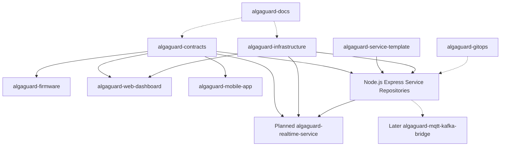

# Repository architecture

AlgaGuard uses a polyrepo under the `AlgaGuard` GitHub organization. Each independently deployable application or service has its own repository. Shared base contracts are complete, and Phase 2.1 defines the portable WebSocket contract amendment.

## Planned repositories

| Group               | Repositories                                                                                                                                                                                                                                                                                                                                                        |
| ------------------- | ------------------------------------------------------------------------------------------------------------------------------------------------------------------------------------------------------------------------------------------------------------------------------------------------------------------------------------------------------------------- |
| Organization        | `.github`, `algaguard-docs`, `algaguard-contracts`, `algaguard-service-template`, `algaguard-infrastructure`, `algaguard-gitops`                                                                                                                                                                                                                                    |
| Devices and clients | `algaguard-firmware`, `algaguard-web-dashboard`, `algaguard-mobile-app`                                                                                                                                                                                                                                                                                             |
| Services            | `algaguard-api-gateway`, `algaguard-device-service`, `algaguard-access-service`, `algaguard-profile-service`, `algaguard-telemetry-service`, `algaguard-command-service`, `algaguard-alert-service`, `algaguard-notification-service`, `algaguard-ota-service`, `algaguard-audit-service`, `algaguard-mqtt-ingestion-service`, planned `algaguard-realtime-service` |
| Later scale         | `algaguard-mqtt-kafka-bridge`                                                                                                                                                                                                                                                                                                                                       |

Repository-level ownership and interface details are authoritative in [service boundaries](../backend/service-boundaries.md).

## Non-service repository catalog

For repositories without runtime interfaces, MQTT/HTTP/events are recorded as not applicable. All CI descriptions are planned; Phase 1 creates no workflow.

| Repository                   | Purpose / technology                                      | Owned data                                    | Interfaces (incoming; outgoing)                           | MQTT / HTTP / events                                                 | Deployment / image                                                        | CI / phase                                           | Pilot / scale role                            |
| ---------------------------- | --------------------------------------------------------- | --------------------------------------------- | --------------------------------------------------------- | -------------------------------------------------------------------- | ------------------------------------------------------------------------- | ---------------------------------------------------- | --------------------------------------------- |
| `.github`                    | Organization governance and shared GitHub metadata        | Templates/policies                            | Maintainer changes; organization defaults                 | N/A                                                                  | Not deployed; no image                                                    | Lint/validate shared files; Phase 16                 | Common governance / same                      |
| `algaguard-docs`             | Architecture and project documentation; Markdown/Mermaid  | Decisions and plans                           | Project evidence; links to all repos                      | N/A                                                                  | Static docs if later chosen; no required image                            | Link/Mermaid lint; Phase 1                           | Pilot plan / scale plan                       |
| `algaguard-contracts`        | OpenAPI, AsyncAPI, JSON Schema/Zod-compatible definitions | Versioned protocols/schemas                   | Domain decisions; generated/consumed contract artifacts   | Owns topic, endpoint, and event definitions                          | Package/artifact, not a service; image normally N/A                       | Validate compatibility/publish; Phase 2              | Pilot contracts / evolution boundary          |
| `algaguard-service-template` | Express/TypeScript service conventions                    | Template files                                | Standards/contracts; new service scaffolds                | Health endpoint pattern; no domain topics/events                     | Template, no runtime image                                                | Template tests/dependency checks; Phase 2            | Consistency / scale operations consistency    |
| `algaguard-infrastructure`   | Portable local/AWS bootstrap                              | Environment configuration excluding secrets   | Images/config; Compose/local/AWS runtime                  | Exposes planned HTTPS/MQTT endpoints                                 | Deploys stack; image N/A                                                  | Config/security validation; Phases 5 onward          | Pilot host / reusable bootstrap               |
| `algaguard-gitops`           | Kubernetes desired state and Argo CD configuration        | Versioned deployment desired state            | GHCR images/config; campus clusters                       | Routes HTTPS; MQTT remains separate EMQX endpoint                    | Kubernetes/Helm artifacts; image N/A                                      | Manifest/policy validation; Phase 17                 | No pilot requirement / orchestration target   |
| `algaguard-firmware`         | ESP-IDF/PlatformIO FreeRTOS device firmware               | Local configuration/cache/SD records          | Hardware, BLE/config/MQTT/HTTPS; telemetry/status/results | Device topics from [event flow](../backend/event-flow.md); HTTPS OTA | ESP32 binary, not container                                               | Build/unit/hardware tests/signing gates; Phases 3-15 | Demo device / 1,000-device protocol peer      |
| `algaguard-web-dashboard`    | React/TypeScript/Vite web client                          | Browser state/cache only                      | User input, OIDC, HTTPS, and later WSS                    | HTTPS `/api/v1/*`; WSS live updates; no MQTT                         | Static web artifact/container `ghcr.io/algaguard/algaguard-web-dashboard` | Build/test/a11y/scan/publish; Phase 11               | Main dashboard / paginated aggregate UI       |
| `algaguard-mobile-app`       | Flutter/Dart mobile client                                | Secure tokens and optional Drift/SQLite cache | OIDC/API/QR/BLE; provisioning, HTTPS, and later WSS       | HTTPS API; WSS live updates; BLE device protocol; no direct MQTT     | Mobile packages, no server image                                          | Analyze/test/build/signing gates; Phase 12           | Provisioning/client / efficient mobile access |

The service repository catalog, including purpose, owned data, HTTP/MQTT/events, image, CI, phase, and pilot/scale role, is in [service boundaries](../backend/service-boundaries.md).
