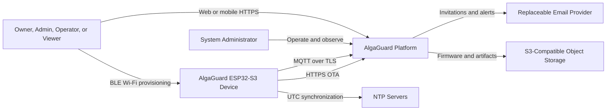

# System context

The platform authenticates people through Keycloak and devices through separate device identities. Its authorization rules are defined in [access control](../backend/access-control.md).
