# System overview

Status: Phase 2.1 target architecture; not implemented.

AlgaGuard combines a local offline-first device with web and mobile clients and a cloud-agnostic service platform. The one-device pilot, campus deployment, and full scale target are distinct capacity stages; see [scale target](scale-target.md).

```mermaid
flowchart TB
    USER((AlgaGuard User))

    subgraph CLIENTS["Clients"]
        WEB["React Web Dashboard"]
        MOBILE["Flutter Mobile App"]
    end

    subgraph DEVICE["Physical AlgaGuard Device"]
        ESP["ESP32-S3 N16R8"]
        OLED["OLED"]
        RTC["PCF8563 RTC"]
        SD["MicroSD"]
        BUTTONS["Four Buttons"]
        LEDS["Red Green Blue Indicators"]
        MOCK["Mock Data"]
        PROFILE["Cached Algae Profile"]
        BATCH["1 s Samples / 10 s Batch"]
        MQTT["MQTT TLS Client"]
        OTA["HTTPS OTA"]
        BUTTONS --> ESP
        OLED <--> ESP
        RTC <--> ESP
        SD <--> ESP
        ESP --> LEDS
        MOCK --> BATCH
        PROFILE --> ESP
        BATCH --> MQTT
        OTA --> ESP
    end

    MOBILE -->|"BLE Provisioning"| ESP

    subgraph PLATFORM["Cloud-Agnostic AlgaGuard Platform"]
        NGINX["NGINX HTTP HTTPS"]
        EMQX["EMQX MQTT TLS"]
        KEYCLOAK["Keycloak OIDC"]

        subgraph SERVICES["Node.js Express TypeScript Services"]
            API["API Gateway"]
            DEVICE_SVC["Device Service"]
            ACCESS_SVC["Access Service"]
            PROFILE_SVC["Profile Service"]
            TELEMETRY_SVC["Telemetry Service"]
            COMMAND_SVC["Command Service"]
            ALERT_SVC["Alert Service"]
            NOTIFY_SVC["Notification Service"]
            OTA_SVC["OTA Service"]
            AUDIT_SVC["Audit Service"]
            INGESTION["MQTT Ingestion Service"]
            REALTIME["Realtime Service"]
        end

        POSTGRES[("PostgreSQL")]
        TIMESCALE[("TimescaleDB")]
        REDIS[("Redis")]
        OBJECTS[("S3-Compatible Storage: S3 or MinIO")]
        BRIDGE["Later MQTT-Kafka Bridge"]
        KAFKA["Later Apache Kafka"]
        OTEL["OpenTelemetry"]
        PROM["Prometheus"]
        GRAFANA["Grafana"]
        LOKI["Loki"]
        TEMPO["Tempo"]
    end

    USER --> WEB
    USER --> MOBILE
    WEB -->|"HTTPS"| NGINX
    MOBILE -->|"HTTPS"| NGINX
    NGINX -->|"WSS"| REALTIME
    ESP -->|"MQTT TLS"| EMQX
    ESP -->|"HTTPS OTA"| NGINX
    NGINX --> API
    NGINX --> KEYCLOAK
    API --> KEYCLOAK
    API --> DEVICE_SVC
    API --> ACCESS_SVC
    API --> PROFILE_SVC
    API --> TELEMETRY_SVC
    API --> COMMAND_SVC
    API --> ALERT_SVC
    API --> OTA_SVC
    API -->|"One-Time Ticket"| REALTIME
    EMQX -->|"Pilot Direct Path"| INGESTION
    INGESTION --> TELEMETRY_SVC
    COMMAND_SVC --> EMQX
    OTA_SVC --> EMQX
    EMQX -.-> BRIDGE
    BRIDGE -.-> KAFKA
    KAFKA -.-> TELEMETRY_SVC
    KAFKA -.-> ALERT_SVC
    KAFKA -.-> AUDIT_SVC
    DEVICE_SVC --> POSTGRES
    ACCESS_SVC --> POSTGRES
    PROFILE_SVC --> POSTGRES
    ALERT_SVC --> POSTGRES
    OTA_SVC --> POSTGRES
    AUDIT_SVC --> POSTGRES
    TELEMETRY_SVC --> TIMESCALE
    API --> REDIS
    TELEMETRY_SVC -->|"Live Events"| REDIS
    DEVICE_SVC -->|"Live Events"| REDIS
    ALERT_SVC -->|"Live Events"| REDIS
    COMMAND_SVC -->|"Live Events"| REDIS
    PROFILE_SVC -->|"Live Events"| REDIS
    OTA_SVC -->|"Live Events"| REDIS
    NOTIFY_SVC -->|"Live Events"| REDIS
    REDIS -->|"Non-Durable Fan-Out"| REALTIME
    OTA_SVC --> OBJECTS
    SERVICES --> OTEL
    OTEL --> PROM
    OTEL --> LOKI
    OTEL --> TEMPO
    PROM --> GRAFANA
    LOKI --> GRAFANA
    TEMPO --> GRAFANA

    subgraph TARGETS["Interchangeable Deployment Targets"]
        LOCAL["Developer PC Docker Compose"]
        AWS["AWS EC2 Temporary Host"]
        CAMPUS["Campus Server Final Host"]
        CAMPUS_K8S["Optional Campus k3s or Kubernetes"]
    end
    LOCAL -.-> PLATFORM
    AWS -.-> PLATFORM
    CAMPUS -.-> PLATFORM
    CAMPUS_K8S -.-> PLATFORM
```

## Architectural rules

- Device communication is MQTT over TLS; firmware downloads use HTTPS.
- Browser and mobile live updates use WSS through the planned Realtime Service. HTTPS remains authoritative for state recovery and commands.
- Human authentication is Keycloak OIDC. Devices use separate credentials or certificates.
- Every WebSocket subscription is authorized through the Access Service; connection authentication alone grants no resource access.
- The pilot uses direct MQTT ingestion. Kafka and Kubernetes are later targets.
- Every service owns its data and does not query another service's tables directly.
- Amazon S3 and SES are optional implementations behind [provider adapters](../backend/provider-adapters.md), not domain dependencies.
- Migration changes infrastructure and DNS, not business logic or the ESP32 protocol.

See [runtime architecture](runtime-architecture.md), [Realtime Service](../backend/realtime-service.md), [security](security-architecture.md), [cloud portability](cloud-portability.md), [ADR-014 for temporary AWS hosting](../decisions/ADR-014-aws-temporary-host.md), [ADR-015 for final campus hosting](../decisions/ADR-015-campus-final-host.md), [ADR-016 for portable object storage](../decisions/ADR-016-s3-compatible-storage.md), and [ADR-017 for portable WebSocket delivery](../decisions/ADR-017-websocket-realtime-service.md).
