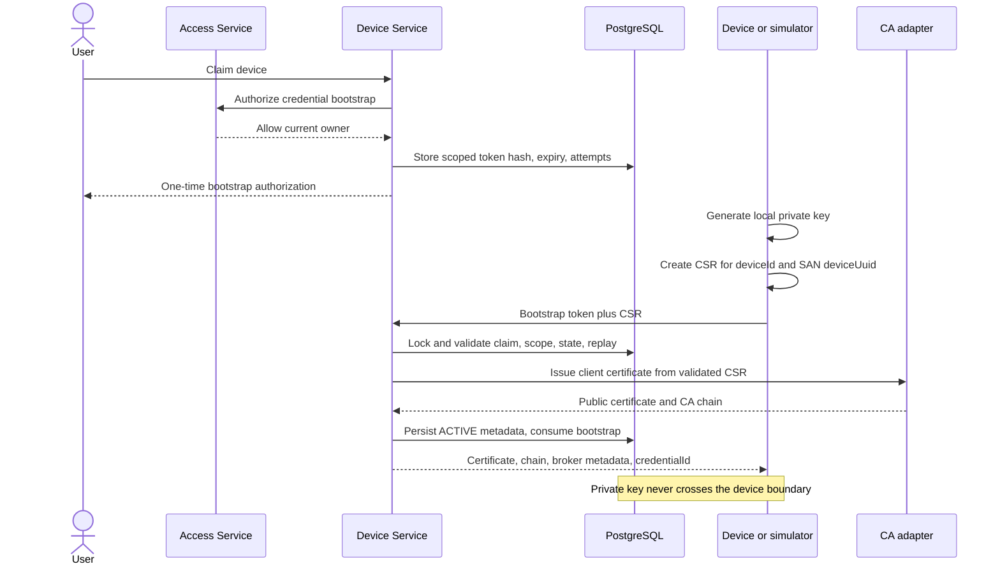
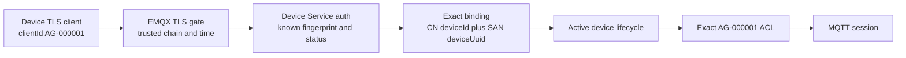
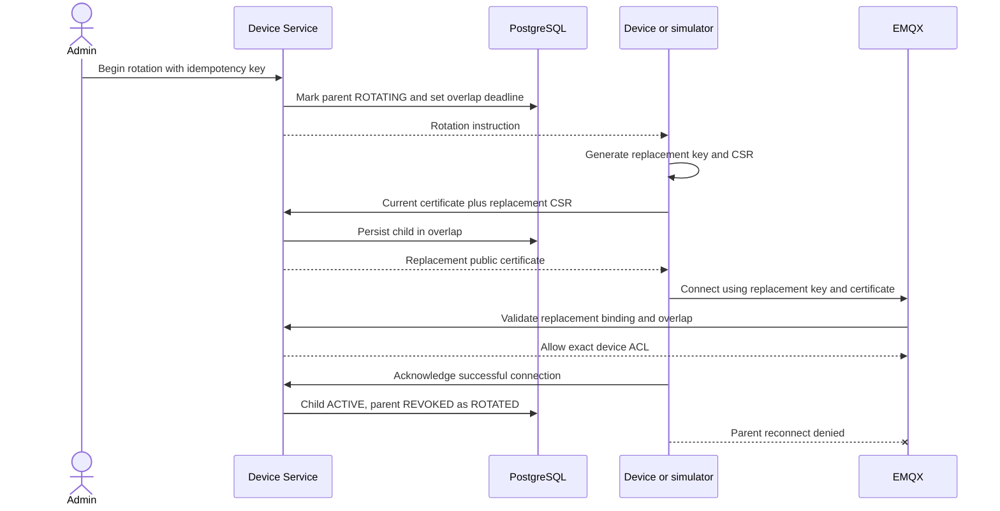
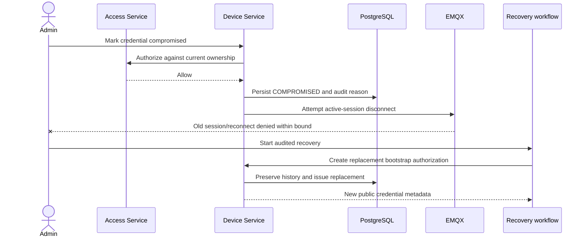
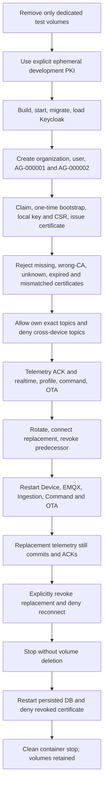

# Device credential lifecycle

This is the authoritative operational description of AlgaGuard device X.509 bootstrap, MQTT authentication, scoped ACLs, rotation, revocation, compromise recovery, and the authenticated local proof. The governing decision is [ADR-019](../decisions/ADR-019-per-device-x509-credentials.md).

## Trust boundaries

| Actor | May provide | Must not be trusted to provide |
| --- | --- | --- |
| Person | Authenticated request and intended device action | Device private key, live MQTT identity, backend ownership context |
| Device/simulator | Canonical `deviceId`, `deviceUuid` scope, CSR, MQTT payload | `organizationId`, CA decision, authorization result |
| Device Service | Credential state, binding, broker metadata, current device context | Device private key |
| Access Service | Current human authorization decision | Certificate proof or MQTT topic identity |
| EMQX | Verified peer certificate, authenticated client ID, exact ACL decision | Current organization ownership |
| MQTT Ingestion | Topic/payload agreement and service-authenticated context | Device-supplied organization context |

## Bootstrap and issuance

**CONFIRMED:** Claim is a human ownership action. Credential bootstrap is a separate, short-lived authorization for one immutable `deviceUuid`/`deviceId` pair. The bearer value is returned once, stored only as a hash, has a bounded attempt budget, and is consumed after issuance. It is not a permanent device password.



The CSR signature, public-key algorithm, subject CN, and SAN URI are inspected before signing. Malformed/unsupported/mismatched CSRs fail with recoverable audited state. Expired, replayed, wrong-scope, unclaimed, inactive, and revoked-device requests fail. An idempotency key safely identifies a repeated successful request; a database transaction permits at most one active initial credential.

## MQTT mutual TLS and identity validation

The host device listener is `mqtts://localhost:8883` in development. It requires a client certificate chained to the development device CA. The internal `mqtts://emqx:8884` listener is available only on the Compose network and requires a certificate from the separate service CA. Plaintext MQTT and default WS/WSS listeners are disabled.



Connection acceptance requires all of the following:

1. A trusted client-auth certificate within its validity window.
2. A known SHA-256 fingerprint and serial in Device Service.
3. Credential state `ACTIVE`, or `ROTATING` within its recorded overlap.
4. MQTT client ID and certificate CN equal the canonical `deviceId`.
5. The one SAN URI equals `urn:algaguard:device:<deviceUuid>`.
6. The bound device is in its active lifecycle and has trusted current context.
7. The credential is not revoked, expired, or compromised.

TLS validity alone is insufficient. Device Service returns an expiry-bounded decision and exact topic permissions. The local revocation target is five seconds; production must choose a bounded value based on its incident-response requirements.

## Exact device ACL

For certificate/client ID `AG-000001`, no wildcard is granted to the device.

| Action | Exact permitted suffixes under `algaguard/v1/devices/AG-000001/` |
| --- | --- |
| Publish | `telemetry`, `health`, `status`, `command-results`, `configuration/ack`, `ota/status` |
| Subscribe | `telemetry/ack`, `commands`, `configuration`, `ota` |

Cross-device topics such as `algaguard/v1/devices/AG-000002/...`, device wildcard subscriptions, organization/internal topics, management topics, and `$SYS/#` are denied. Backend service certificates have separate narrow wildcard grants only for the topics their service owns.

MQTT Ingestion independently requires equality between broker-authenticated `deviceId`, topic `deviceId`, payload `deviceId`, and Device Service context. It does not trust public proxy identity headers. Application acknowledgement is published only after Telemetry commits the batch; broker QoS 1 acknowledgement is not a durable application acknowledgement.

## Rotation

**CONFIRMED:** A normal rotation preserves the last working credential while a new locally generated key and CSR are tested. Rotation request and acknowledgement are idempotent and stored durably.



The default development overlap is 300 seconds and is configurable. A stale rotation or acknowledgement is rejected. Duplicate CSR/ack actions return the recorded result. Timeout or issuance failure leaves explicit recovery state; it does not silently destroy the known working credential.

## Revocation and compromise recovery

Revocation status is authoritative in Device Service and persists in PostgreSQL. Reasons are `ROTATED`, `EXPIRED`, `COMPROMISED`, `ADMIN_REVOKED`, `DEVICE_RETIRED`, `ISSUANCE_ERROR`, and `RECOVERY_REPLACED`. Reconnect is denied when the EMQX cache expires; emergency broker-session termination is attempted when management integration is configured.



Compromise recovery requires a newly authorized local key/CSR and records the replacement relationship. Credential rows and audit history are never deleted. CRL and OCSP support are not claimed.

## Local development PKI

Run these commands from `algaguard-infrastructure` after copying `.env.example` to `.env`:

```text
make pki-init
make pki-server-cert
make pki-service-cert SERVICE_NAME=algaguard-mqtt-ingestion-service
make pki-service-cert SERVICE_NAME=algaguard-command-service
make pki-service-cert SERVICE_NAME=algaguard-ota-service
make pki-ota-signing-key
make pki-device-cert DEVICE_ID=AG-000001 DEVICE_UUID=<uuid>
make pki-inspect
make pki-clean-dev
```

Initialization is explicit, prints a development-only warning, refuses overwrite, and protects private files with restrictive permissions where supported. `pki-inspect` prints public certificate information, never private content. Cleanup requires explicit confirmation and is limited to `.local/pki`. Application bootstrap normally generates simulator/device keys and CSRs; `pki-device-cert` is a diagnostic convenience.

The `.local` tree is Git-ignored. Never commit or archive a CA key, device key, service key, OTA signing key, bootstrap token, or E2E working directory. `.env.example` contains paths and development placeholders only.

## Authenticated local E2E



Run `make credential-e2e` from `algaguard-infrastructure`. The runner uses the fixed Compose project `algaguard-credential-e2e`, so fresh-volume deletion cannot target the default project. On success it leaves no containers and does not delete the final volumes.

Safe evidence is written under ignored `.local/evidence`: device and credential IDs, truncated fingerprints, public validity times, boolean ACL/auth/flow outcomes, metric snapshots, and rotation/restart/revocation timings. Private keys and full certificate bodies are excluded. CI recreates its development PKI and does not upload that directory.

## Metrics and audit

Device Service exposes service-authenticated counters for mTLS acceptance, credential mismatch, revoked/expired attempts, and inactive-device attempts. MQTT Ingestion separately counts topic/payload/context mismatch, limits, accepted batches, duplicates, and acknowledgement outcomes. Counters are process telemetry and may reset on restart; durable credential history and audit records remain in PostgreSQL.

## Current limitations and open decisions

- **CONFIRMED:** Validation uses simulated devices and a local Docker Compose environment.
- **CONFIRMED:** Firmware evidence is build/host-test evidence only; a real ESP32 has not been flashed or validated.
- **TBD:** Production CA/provider, root custody, renewal, CRL/OCSP, and production revocation distribution.
- **TBD:** AWS and campus deployment, stable public DNS, firewall exposure, and public certificate automation.
- **TBD:** Physical BLE, MicroSD, battery/3S, power, and scientific-threshold work.
- **ASSUMPTION:** Production limit values will be selected from load, security, and recovery evidence; development defaults are not capacity or scientific approval.

See [transport security limits](../architecture/transport-security-limits.md) for every current configuration boundary.

