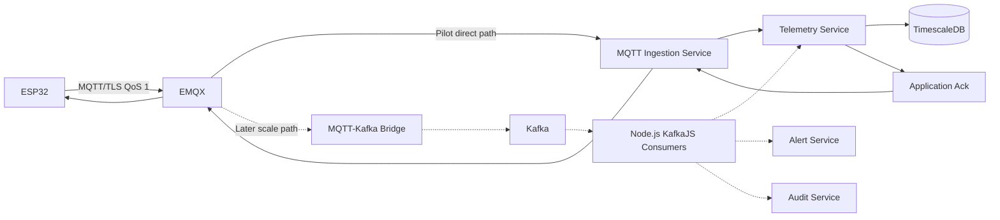
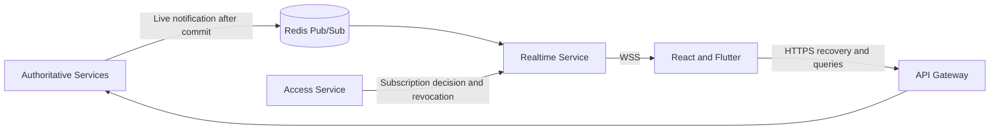

# Messaging and event flow

The ESP32 never connects to Kafka. Kafka is absent from the free pilot and is introduced only after load and reliability evidence supports [ADR-004](../decisions/ADR-004-kafka-later-scale-phase.md).

## Realtime client flow

**CONFIRMED Phase 2.1:** Authoritative services publish live-notification events to Redis Pub/Sub after committing state. The planned Realtime Service validates each outgoing event, maps it to Access Service-authorized active subscriptions, and sends it to React and Flutter over WSS.

Event sources are Telemetry Service for `telemetry.updated`; Device Service for health/status; Alert Service for alert lifecycle; Command Service for command status; Profile Service and validated device acknowledgement for profile changes/application; OTA Service for OTA status; and Notification Service for system notifications.

Redis Pub/Sub is not authoritative or durable. On disconnect, clients use exponential backoff with jitter, obtain a new one-time ticket, reconnect, fetch the latest state through HTTPS, resubscribe, and continue live events. Telemetry remains in TimescaleDB; alerts, commands, profiles, OTA, access, and notification state remain in their owning service databases.

## Client command flow

React and Flutter submit commands through authenticated and authorized HTTPS REST. The API Gateway routes the request to the Command Service, which records it and publishes the MQTT command through EMQX. Command progress/results return to the client as `command.status.changed` live events. Initial implementations do not accept security-sensitive device commands over WebSocket.

## Telemetry rules

- A normal MQTT message carries roughly ten one-second samples.
- Validate device identity, schema version, batch metadata, sample count, sequence continuity, size, timestamp quality, and parameter encoding.
- Enforce idempotency with `deviceId + sequence`; duplicate QoS 1 delivery is expected.
- Publish an application acknowledgement only after the ingestion acceptance boundary defined in Phase 2. MQTT broker acknowledgement alone is not enough.
- Use bounded retries, backpressure, maximum message size, and explicit rejection reasons.

See the [Realtime Service](realtime-service.md) and [ADR-017](../decisions/ADR-017-websocket-realtime-service.md).
