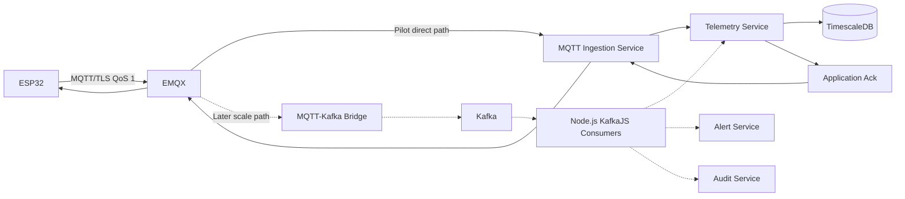

# Messaging and event flow

The ESP32 never connects to Kafka. Kafka is absent from the free pilot and is introduced only after load and reliability evidence supports [ADR-004](../decisions/ADR-004-kafka-later-scale-phase.md).

## Telemetry rules

- A normal MQTT message carries roughly ten one-second samples.
- Validate device identity, schema version, batch metadata, sample count, sequence continuity, size, timestamp quality, and parameter encoding.
- Enforce idempotency with `deviceId + sequence`; duplicate QoS 1 delivery is expected.
- Publish an application acknowledgement only after the ingestion acceptance boundary defined in Phase 2. MQTT broker acknowledgement alone is not enough.
- Use bounded retries, backpressure, maximum message size, and explicit rejection reasons.
