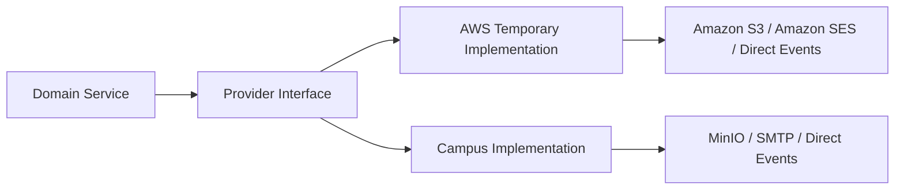

# Provider adapters

Status: Phase 1 design; no provider integration is implemented.

AlgaGuard business logic must remain independent from AWS. `CONFIRMED`: AWS is the temporary host for approximately six months and the campus server is the final deployment target. Provider integrations are replaceable, and provider SDK request, response, identity, ARN, error, and metadata objects must not enter domain models.

## ObjectStorage

Portable operations:

- upload;
- download;
- delete;
- metadata lookup;
- checksum verification;
- temporary signed URL where supported.

The AWS implementation is Amazon S3. The campus implementation is MinIO. Domain services use provider-neutral object keys, checksums, metadata, and version identifiers rather than AWS-specific types. See [ADR-016](../decisions/ADR-016-s3-compatible-storage.md).

## EmailProvider

The interface sends invitation emails, alert emails, and account-related notifications. Amazon SES is the temporary AWS implementation; SMTP is the campus implementation. Provider message IDs and errors are translated into AlgaGuard delivery results before they reach domain logic.

## BackupDestination

The interface stores database backups, Keycloak backups, EMQX configuration backups, object-checksum manifests, and retention metadata. Amazon S3 is the AWS implementation. Campus implementations may be MinIO, NAS, or confirmed campus backup storage. Backup encryption, immutability, retention, restore authorization, and tested recovery remain operational requirements rather than assumptions.

## EventPublisher

The interface publishes versioned domain events containing an event ID and correlation ID. The pilot implementation routes events directly between the responsible Node.js services. A later implementation may publish through KafkaJS only after [ADR-004](../decisions/ADR-004-kafka-later-scale-phase.md) is revisited with load and reliability evidence.

## NotificationProvider

Email is the initial external notification channel. In-app notifications are planned within AlgaGuard. Mobile push may be added later through a replaceable provider, with no Firebase dependency.

## IdentityProvider boundary

Keycloak is the selected identity platform. Services use OIDC discovery and JWT validation; they must not query or mutate Keycloak database tables. The Access Service owns application authorization for organizations, devices, profiles, commands, and administrative actions.

## Environment configuration

Only non-secret configuration names are documented here. Real credentials, passwords, access keys, client secrets, and private keys must be supplied through the approved secret mechanism and must not be committed.

| Variable | Purpose |
|---|---|
| `OBJECT_STORAGE_PROVIDER` | Select the configured S3-compatible implementation |
| `OBJECT_STORAGE_ENDPOINT` | Provider endpoint; supports non-AWS S3-compatible services |
| `OBJECT_STORAGE_REGION` | Provider region where required |
| `OBJECT_STORAGE_BUCKET` | Environment-specific bucket/container name |
| `SMTP_HOST` | SMTP server for the campus/provider implementation |
| `SMTP_PORT` | SMTP connection port |
| `SMTP_USER` | SMTP account identifier; not its password |
| `SMTP_FROM` | Approved sender address |
| `AUTH_ISSUER_URL` | Keycloak OIDC issuer URL |
| `OTEL_EXPORTER_OTLP_ENDPOINT` | Portable OpenTelemetry collector endpoint |

## Environment comparison

| Capability | AWS temporary implementation | Campus implementation |
|---|---|---|
| Object storage | Amazon S3 | MinIO |
| Email | Amazon SES | SMTP |
| Backups | S3 | MinIO or NAS |
| Runtime | EC2 Docker Compose or k3s | Docker Compose, k3s or Kubernetes |
| DNS | Route 53 or existing DNS | Campus or existing DNS |
| TLS | Public certificate | Public or campus certificate |
| MQTT | EMQX | EMQX |
| Authentication | Keycloak | Keycloak |
| Database | PostgreSQL and TimescaleDB | PostgreSQL and TimescaleDB |
| Monitoring | Prometheus, Grafana, Loki and Tempo | Same portable stack |

Provider selection changes infrastructure configuration, not AlgaGuard domain behavior or external device/client contracts. The host decisions are [ADR-014](../decisions/ADR-014-aws-temporary-host.md) and [ADR-015](../decisions/ADR-015-campus-final-host.md).
