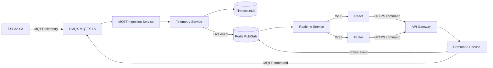

# Realtime Service

Status: **CONFIRMED Phase 2.1 architecture; planned and not implemented.**

The planned `algaguard-realtime-service` provides live React and Flutter updates without changing the device protocol or becoming a system of record. It is an independently deployable Node.js and TypeScript service using native RFC 6455 WebSockets through a lightweight library such as `ws`.

## Transport boundaries

- ESP32-S3 devices continue to use MQTT/TLS through EMQX.
- React and Flutter use HTTPS REST for initial state, history, recovery, and user-created commands.
- The Realtime Service sends live server events to React and Flutter using WSS.
- The Command Service records authorized HTTPS command requests and delivers device commands over MQTT.
- WebSocket clients do not send security-sensitive device commands in the initial implementation.

## Authentication and authorization

1. React or Flutter authenticates with Keycloak.
2. The client requests a short-lived, one-time WebSocket ticket through authenticated HTTPS.
3. The API Gateway validates the Keycloak access token and creates the ticket.
4. The client opens WSS using the ticket; no long-lived access token appears in the URL.
5. The Realtime Service consumes and invalidates the ticket.
6. The client requests organization, device, or current-user subscriptions.
7. The Realtime Service asks the Access Service to authorize every subscription.

Access to one connection does not imply access to every organization or device. Revocation removes affected active subscriptions. WSS is mandatory outside explicitly local development. Clients obtain a new ticket after each disconnect.

## Event sources and ownership

| Producer or source                             | Realtime events                                  |
| ---------------------------------------------- | ------------------------------------------------ |
| Telemetry Service                              | `telemetry.updated`                              |
| Device Service                                 | `device.health.updated`, `device.status.changed` |
| Alert Service                                  | `alert.created`, `alert.updated`                 |
| Command Service                                | `command.status.changed`                         |
| Profile Service                                | `profile.configuration.changed`                  |
| Validated device configuration acknowledgement | `profile.configuration.applied`                  |
| OTA Service                                    | `ota.status.changed`                             |
| Notification Service                           | `system.notification`                            |

Services publish validated live-notification events to Redis Pub/Sub after their authoritative state transition. The Realtime Service subscribes to the appropriate channels, validates outgoing schemas, maps events to authorized active subscriptions, and sends them over WebSocket.

PostgreSQL service databases and TimescaleDB remain authoritative. Redis Pub/Sub is non-durable live fan-out: events can be duplicated, reordered, delayed, or missed during a disconnect. After reconnecting, clients fetch the latest state using HTTPS and then resubscribe.

## Runtime and portability

The service uses OpenTelemetry and exposes health/readiness endpoints, structured logs, connection/subscription metrics, and bounded resource use. The same container image runs with Docker Compose on AWS EC2 and on the campus Linux server. It must not depend on AWS API Gateway WebSocket APIs, AppSync, Firebase Realtime Database, Firebase Cloud Messaging, Socket.IO wire semantics, or a provider-specific hostname.

Implementation must define heartbeat/ping, idle timeout, maximum subscriptions, maximum frame size, rate limiting, bounded outbound queues, slow-client handling, and backpressure closure. Exact values are **TBD** pending implementation load tests and capacity evidence.

The wire contracts are owned by [`algaguard-contracts`](https://github.com/AlgaGuard/algaguard-contracts). See [ADR-017](../decisions/ADR-017-websocket-realtime-service.md), [event flow](event-flow.md), and [client experience](../product/realtime-user-experience.md).
