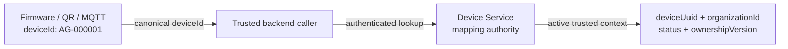
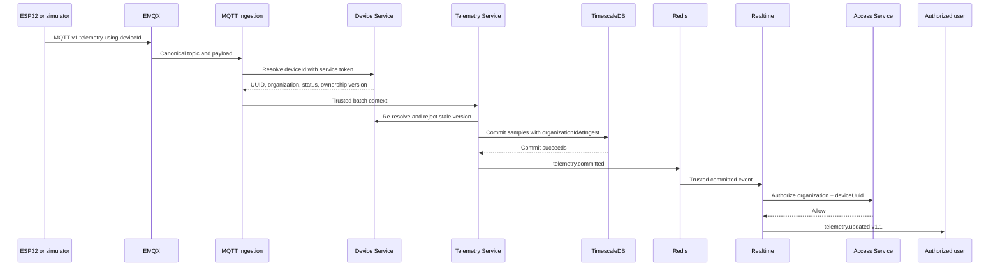
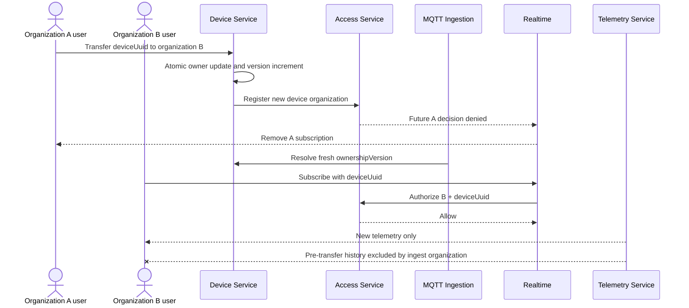

# ADR-018: Dual device identity and trusted organization context

## Status

Accepted and implemented on `develop`

## Date

2026-07-23

## Context

The firmware, OLED, setup QR, MQTT topics, and MQTT payloads identify a device with a stable canonical value such as `AG-000001`. REST resources, authorization decisions, and WebSocket v1 subscriptions use UUID resource identifiers. A canonical MQTT identifier alone does not establish the current organization, and the device must never select or assert its organization.

Released v1 MQTT and WebSocket contracts cannot be changed in place. WebSocket v2 is not required because the existing v1 subscription protocol already supports UUID resource IDs and a compatible v1.1 event can carry enriched identity.

## Decision

Use two immutable identifiers with distinct trust boundaries:

| Field | Meaning | Authoritative uses |
| --- | --- | --- |
| `deviceId` | Canonical `AG-######` identifier | Firmware, OLED, QR, MQTT topic, MQTT payload, display/reference |
| `deviceUuid` | Internal RFC 4122 UUID | Database primary key, REST resource, Access decision, WebSocket subscription |
| `organizationId` | Internal organization UUID | Ownership, authorization, telemetry-at-ingest, realtime routing |
| `ownershipVersion` | Monotonic ownership generation | Detecting stale context across transfer or lifecycle changes |

The Device Service owns the trusted mapping:

`deviceId -> deviceUuid + organizationId + lifecycle status + ownershipVersion`

Unknown, unclaimed, inactive, or revoked devices do not produce an active trusted context. Context contains no credential. Calls use authenticated service clients and propagate correlation IDs. Callers must not build context from an MQTT payload, topic metadata other than the canonical lookup key, or any organization value supplied by a device.

## Telemetry and realtime enrichment

The MQTT v1 topic remains `algaguard/v1/devices/{deviceId}/telemetry`. MQTT Ingestion validates the topic and payload identifiers, rejects an organization field supplied by the device, and resolves current context through the Device Service. It forwards `deviceUuid`, trusted `organizationId`, and `ownershipVersion` to the Telemetry Service.

Telemetry stores `organizationIdAtIngest` and `ownershipVersionAtIngest` with each accepted sample. It emits `telemetry.committed` only after the database transaction commits. Realtime validates that internal event, authorizes the current UUID subscription through Access, and emits compatible WebSocket `telemetry.updated` v1.1 with both identifiers. WebSocket v1 connections and UUID subscription semantics are unchanged.

## Ownership transfer and historical isolation

Device Service changes ownership atomically, appends audit history, and increments `ownershipVersion`. Access resolves the current Device context for future decisions. MQTT Ingestion retries once with fresh context when Telemetry rejects a stale version. Realtime performs event-time authorization and removes unauthorized active subscriptions, so future live events route only to the new organization.

Historical telemetry is not rewritten. Normal history and aggregate queries are filtered by the caller's trusted current organization and `organizationIdAtIngest`. The new owner receives telemetry accepted after transfer but does not automatically receive pre-transfer rows. Raw retained rows remain available only for a later explicitly approved audit policy.

Implementations currently avoid authorization/context caches on the critical path. Any future cache must have a bounded TTL, be keyed by the appropriate identity and ownership generation, invalidate on lifecycle or ownership change, and preserve downstream stale-version rejection.

## Compatibility

- MQTT v1 topics and payload identity continue to use `deviceId`.
- The firmware and setup QR do not need `deviceUuid` or `organizationId`.
- REST, Access, and WebSocket device resources use `deviceUuid`.
- WebSocket v1 subscribe/unsubscribe/ping behavior is unchanged.
- `telemetry.updated` v1.1 is a compatible enriched event; no WebSocket v2 is introduced.
- Released v1 schema files remain unchanged.

## Validation evidence

The automated local Compose identity test starts and migrates the services, activates `AG-000001`, delivers telemetry to the authorized UUID subscriber, denies another organization, restarts Device/Access/Ingestion/Telemetry/Realtime, transfers ownership, proves old-subscription revocation and new-owner delivery, retains pre-transfer ingest ownership, rejects stale context and invalid inputs, and proves duplicate replay creates no row. The same identity vertical slice passes in infrastructure CI.

This evidence is development validation, not AWS/campus deployment, physical-device acceptance, load capacity, or approval of a broader historical-audit access policy.

## Consequences

- Consumers must not treat `deviceId` and `deviceUuid` as interchangeable.
- Service-to-service identity resolution is required before canonical device traffic enters organization-scoped storage or realtime routing.
- Current authorization can change immediately after transfer even though historical rows retain their ingest owner.
- Operational monitoring must distinguish unknown/lifecycle rejection, injected organization data, stale ownership context, invalid committed events, and authorization denial.

## Alternatives considered

- Change firmware and MQTT to UUID identifiers.
- Authorize WebSocket subscriptions using canonical `deviceId` alone.
- Trust `organizationId` from the device payload.
- Rewrite historical telemetry when ownership changes.
- Replace the released WebSocket protocol with v2.

These alternatives either break compatibility, weaken the organization trust boundary, or risk historical cross-organization exposure.

## Related documents

- [Runtime architecture](../architecture/runtime-architecture.md)
- [Security architecture](../architecture/security-architecture.md)
- [Event flow](../backend/event-flow.md)
- [Access control](../backend/access-control.md)
- [Data ownership](../backend/data-ownership.md)
- [Realtime Service](../backend/realtime-service.md)
- [ADR-017: Portable WebSocket Realtime Service](ADR-017-websocket-realtime-service.md)
