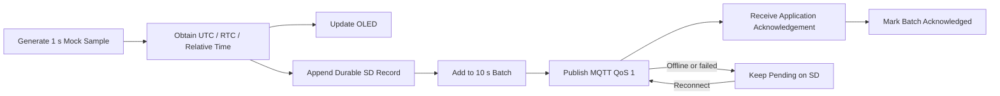

# Offline storage and batch design

`CONFIRMED`: Generate one simulated sample per second and build a normal batch of about ten samples every ten seconds. The platform-first firmware retains unacknowledged data behind a queue abstraction using a RAM/NVS development adapter.

`SAFETY`: The 32 GB MicroSD adapter is disabled until its electrical interface and physical wiring are validated. The two-day removable-storage goal below remains planned and must not be claimed from the RAM/NVS adapter.

## Planned batch envelope

| Field | Purpose |
|---|---|
| `deviceId` | Device identity |
| `batchId` | Unique batch identity |
| `firstSequence` / `lastSequence` | Ordering and gap detection |
| `sampleCount` | Declared count, normally about ten |
| `samples` | One-second sample records |
| `createdAt` | Batch time when valid |
| `schemaVersion` | Contract evolution |

`deviceId + sequence` is the sample idempotency key. MQTT QoS 1 delivery is insufficient to declare ingestion complete; delete/reclaim pending data only after an application acknowledgement identifies the accepted batch or sample range.

## Recovery and retention

- Append records before considering them eligible for publish.
- Recover incomplete tails safely after reset or power loss.
- Keep acknowledged and pending state crash-consistent.
- Replay oldest pending batches with rate limiting after reconnect while continuing current samples.
- Protect unacknowledged data from normal ring deletion until the policy's emergency limit is reached; report any forced loss explicitly.
- Verify filesystem, format, record encoding, checksum/CRC, wear strategy, card health, and exact record size during implementation.

Cloud retention differs from local retention and is defined in the [capacity plan](../project-management/capacity-plan.md).
