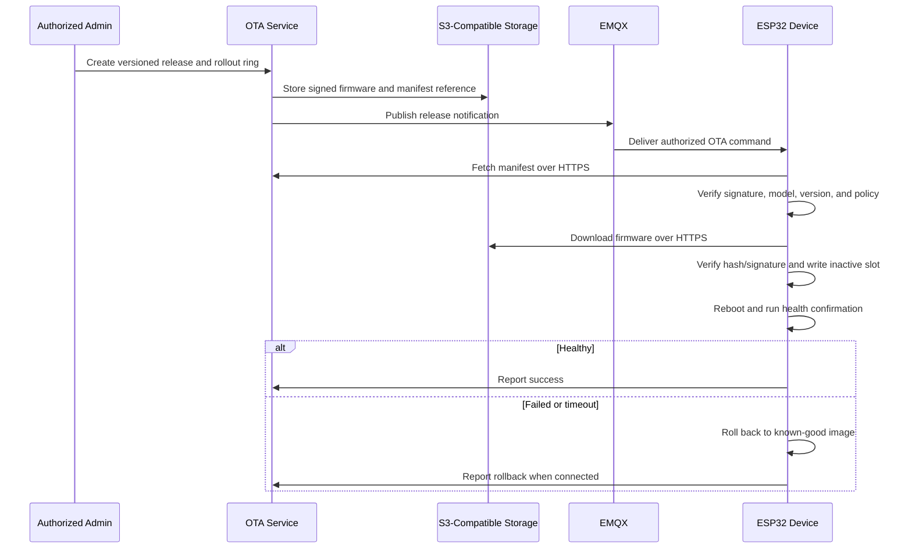

# OTA design

Signed OTA and rollback are production targets, not Phase 1 implementation claims.

## Requirements

- Firmware binaries and manifests live behind the S3-compatible storage interface: optional Amazon S3 on AWS, MinIO/campus storage later.
- Signing keys are separated from runtime storage credentials and never committed.
- Validate device model, hardware compatibility, version monotonicity/downgrade policy, size, hash, signature, expiry, and rollout authorization.
- Use rings, pauses, progress, timeout, retry limits, failure thresholds, and auditable rollback.
- Network loss must not invalidate the currently bootable image.
- Exact ESP-IDF partition layout, key custody, anti-rollback policy, and recovery procedure are `TBD` for the implementation phase.
