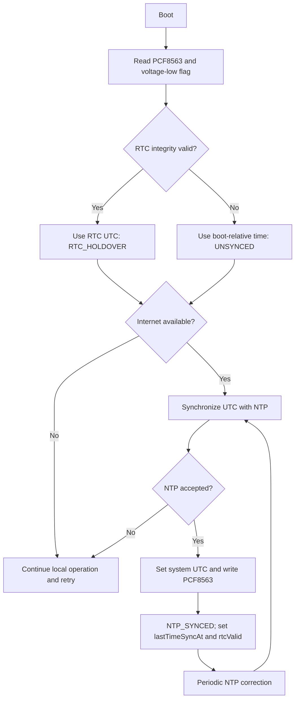

# Timekeeping design

This is the authoritative timestamp policy.

## Priority

1. NTP-synchronized UTC when Wi-Fi and internet are available.
2. PCF8563 RTC holdover when NTP is unavailable and RTC integrity is valid.
3. Unsynchronized monotonic boot-relative time when neither UTC source is valid.

## Timestamp contract

Every sample includes a canonical UTC timestamp when valid and one quality value:

- `NTP_SYNCED`
- `RTC_HOLDOVER`
- `UNSYNCED`

When quality is `UNSYNCED`, include monotonic boot-relative time and sequence for ordering; do not fabricate a UTC instant. Device health includes `lastTimeSyncAt` and `rtcValid`. The contracts for absent UTC and later reconciliation are a Phase 2 task.

Store and transmit canonical time in UTC. Clients may display a user's local timezone but must not rewrite canonical telemetry time.

On boot, inspect the PCF8563 voltage-low/integrity state. Reject invalid RTC time. After a successful NTP synchronization, update the RTC. `ASSUMPTION`: retry correction on connection and at least daily until measured drift supports another interval. Actual module drift is `TBD`; see [RTC module](../hardware/rtc-module.md).
