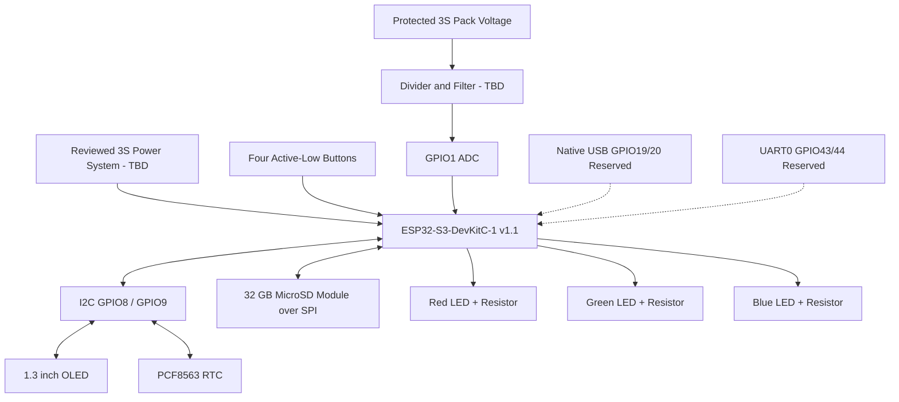

# Hardware overview

Status: Phase 1 proposed prototype; physical validation remains required.

`CONFIRMED`: The controller family is ESP32-S3-DevKitC-1, the supplied pinout represents v1.1, and the retailer listing says N16R8. The exact metal-shield marking and runtime flash/PSRAM values remain `TBD`.

The authoritative component facts are in [hardware inventory](hardware-inventory.md), pin allocation in [preliminary pin plan](preliminary-pin-plan.md), and safety boundary in [power architecture](power-architecture.md).
