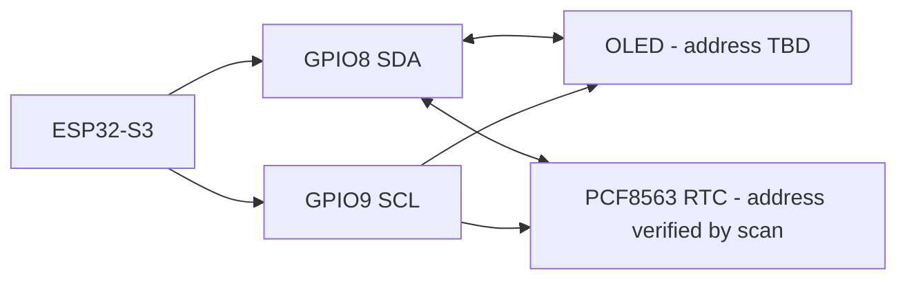

# Hardware interface plan

| Interface | Devices | Requirements |
|---|---|---|
| Shared I2C | OLED and PCF8563 RTC | 3.3 V logic; GPIO8/GPIO9; scan addresses; inspect combined pull-ups and bus rise time |
| SPI | MicroSD module | GPIO10-13; dedicated chip select; bench-check MISO/MOSI/SCK levels and module supply |
| GPIO inputs | Four buttons | Active-low to GND with pull-ups unless electrical review changes this |
| GPIO outputs | Three indicator LEDs | One resistor per LED; no PWM; driver only if current review requires it |
| ADC | 3S pack voltage | Protected divider/filter sized above maximum possible pack voltage with margin |
| Service | Native USB and UART0 | Both remain reserved and physically accessible in the enclosure plan |

The exact pins and reserved set are authoritative in [preliminary pin plan](preliminary-pin-plan.md).
