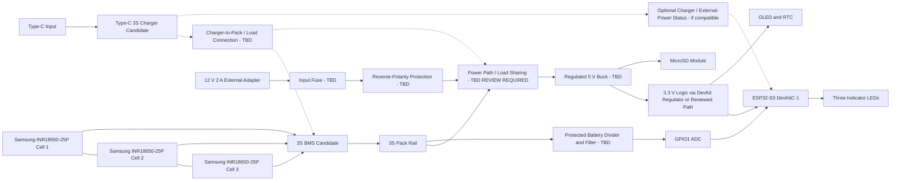

# Power architecture

Status: conceptual only. It is not a construction-ready schematic or approved wiring plan.

`SAFETY`: The platform-first prototype is USB-powered only. None of the 3S pack, charger, charge-while-operating path, battery percentage, divider, or ADC concepts below are implemented or approved. Keep this entire design behind the existing electrical review gate.

The dashed charger connections are intentionally unresolved. The diagram shows functional blocks, not exact wiring. The charger input and external 12 V adapter paths require reconciliation in a reviewed topology; the diagram must not be read as permission to connect the 12 V adapter across the pack.

## Confirmed requirements and candidates

- `CONFIRMED`: Three 18650 cells are arranged 3S; battery percentage is required; current monitoring is not required; the device must operate while charging.
- `VENDOR-LISTED`: Cells are nominal 3.6 V, 2500 mAh, and unprotected; the candidate BMS is sold as 3S 20 A; the charger advertises a 12.6 V charging output; the adapter advertises 12 V 2 A center-positive.
- BMS, charger, wires, fuses, holders, and connectors must be selected from reviewed electrical requirements, not headline current values.

## Safety blockers

- `SAFETY`: A BMS is protection, not automatically a complete charger or power-path controller.
- `SAFETY`: Charge-while-operating requires a reviewed load-sharing or source-selection design. This is `TBD`.
- `SAFETY`: Never connect the external adapter directly across the battery pack without a reviewed charging topology.
- `SAFETY`: Never connect 12 V directly to an ESP32 GPIO or 3.3 V pin. A reviewed regulated buck stage is required.
- `SAFETY`: The divider must tolerate the maximum possible 3S pack voltage and faults with margin while keeping GPIO1 within absolute limits.
- `SAFETY`: Review cell authenticity and matching, pack assembly method, fuse position/rating, wire gauge, connectors, thermal behavior, enclosure heat, and safe service access before construction.

## Battery percentage

Estimate state of charge from calibrated pack voltage using multiple voltage points, filtering, hysteresis, and load-aware settling. Voltage sag means the estimate is approximate; do not claim laboratory-grade state of charge. The curve and displayed bands are `TBD` after bench measurements.

## Electrical isolation decision

The user requires electrical isolation, but its boundary is `TBD`. Review the external 12 V input, future submerged sensor power/data, communication interfaces, and indicator outputs. Low-voltage local indicator LEDs normally require current limiting rather than galvanic isolation; do not add optocouplers everywhere without a hazard-based reason. Record the final boundary in a later ADR after electrical review.
