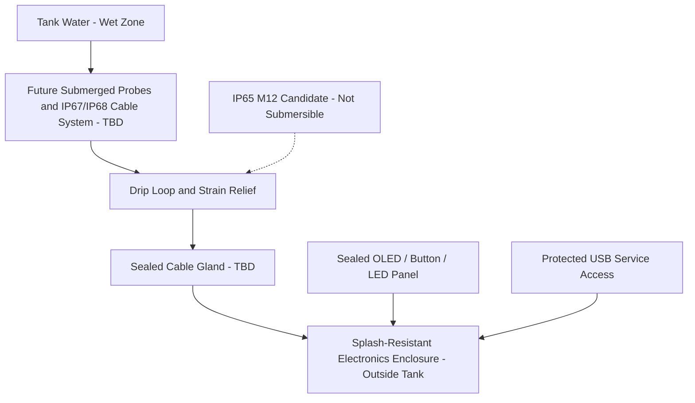

# Water-ingress plan

## Boundary rules

- `CONFIRMED`: Indoor use, outside-tank mounting, and water resistance near the tank.
- Do not claim that the enclosure or the vendor-listed IP65 M12 connector is submersible.
- Use downward-facing entries where practical, drip loops, strain relief, sealed glands, and separation between likely ingress paths and energized electronics.
- Future submerged sensors need appropriately rated waterproof probes, cable assemblies, glands, and IP67/IP68 connectors selected for the exact immersion conditions.
- Condensation control, vents, seals, torque, enclosure material, and post-assembly ingress test are `TBD`.
- `SAFETY`: Keep battery, charging, and 12 V interfaces outside wet zones and have the completed assembly reviewed before use near a tank.
