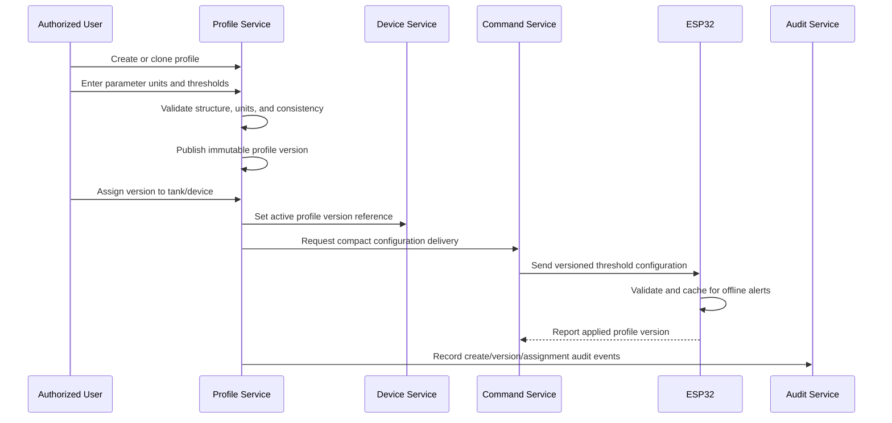

# Algae profile flow

Values are user-configured; Phase 1 invents no species thresholds. A later supervisor-approved template is a new reviewed version, not silent scientific authority. Historic telemetry and alerts retain their original profile/version context.
