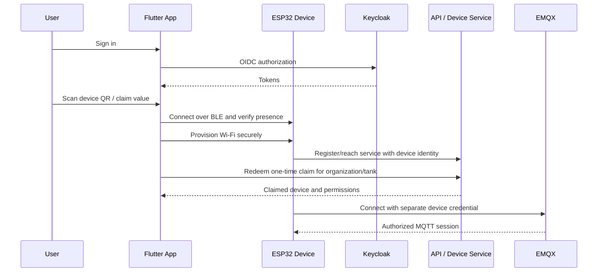

# Device onboarding and claiming

Claim and BLE proof details are `TBD` for Phase 2. Claim values are one-time, short-lived, resistant to guessing, and never device MQTT credentials. Reclaim, factory reset, ownership transfer, and lost-device recovery require explicit audited policies.
