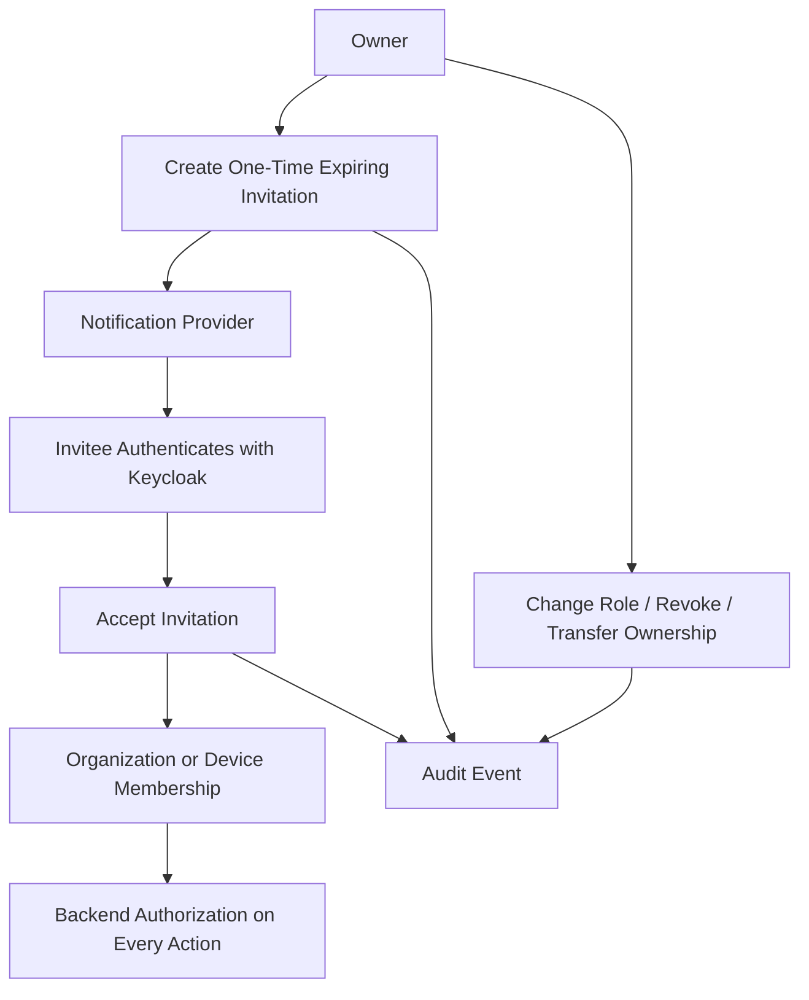

# Device sharing

`CONFIRMED`: Many accounts may be invited to a device, with no hard product-level cap. This is not unlimited capacity. List operations are paginated, invitations throttled, request sizes bounded, uniqueness enforced, and abuse monitored. Bulk member import is deferred.
